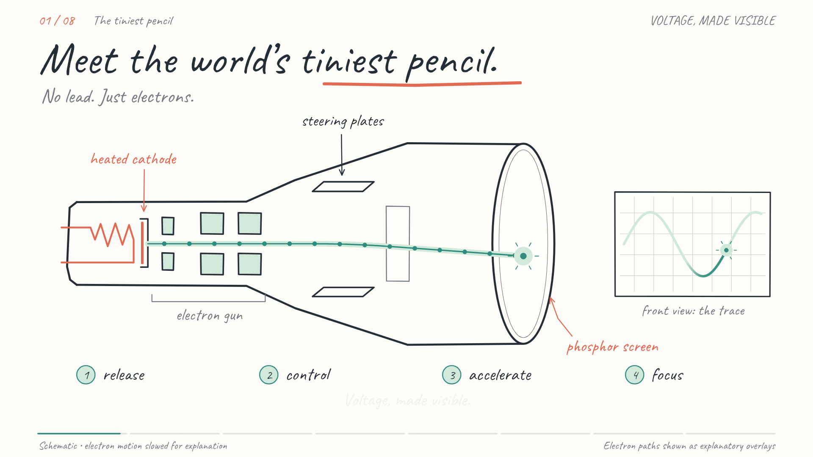

# Oscilloscope explainer — the world’s tiniest pencil

A complete animated explanation of how a classic analog oscilloscope works, from the electron gun to the glowing trace. The visuals are drawn entirely with code, in a whiteboard doodle style with **Caveat** handwriting. British narration is by **Christopher — Gentle and Trustworthy**, generated with ElevenLabs.

[](outputs/oscilloscope-how-it-works.mp4)

**[Watch or download the finished video](outputs/oscilloscope-how-it-works.mp4)** · [English captions](outputs/oscilloscope-captions.srt) · [Narration script](outputs/narration-script.md) · [Video source and detailed credits](outputs/video-source/README.md)

The film runs **3 minutes 18 seconds**, at **1920 × 1080 and 24 fps**. The MP4 includes H.264 video, AAC narration, optional English subtitles, and chapter markers. If GitHub displays a file page instead of a player, use its download control to watch the MP4 locally.

## What the film explains

1. The tube and the electron gun’s four jobs.
2. The separate heater, coated cathode, thermionic emission, replenishment, and vacuum.
3. How negative grid bias controls beam current, brightness, cutoff, and blanking.
4. How accelerating electrodes supply the electrons’ forward energy.
5. How electrode shapes and voltages form an electrostatic lens.
6. How perpendicular plate pairs steer the beam.
7. How a timebase, blanked flyback, and phosphor persistence form a waveform.
8. How triggering stabilizes the trace, with voltage vertically and time horizontally.

The animation progressively reveals each idea, with moving electrons, a tightening focus, live steering, fading phosphor trails, and a trigger demonstration. Particle motion is slowed and dimensions are schematic. The paths drawn inside the tube are explanatory overlays; the visible light is emitted at the phosphor screen.

## Current deliverables

| File or directory | Contents |
| --- | --- |
| [Finished MP4](outputs/oscilloscope-how-it-works.mp4) | Final film with narration, captions, and chapters. |
| [Poster](outputs/oscilloscope-video-poster.png) | Preview of the finished visual direction. |
| [Video source](outputs/video-source/) | Canvas scene modules, renderer, timing, alignment inputs, chapter metadata, and export verification. |
| [Source archive](outputs/oscilloscope-video-source.zip) | Packaged snapshot of the completed film source and required assets. |
| [Captions](outputs/oscilloscope-captions.srt) | 53 cues preserving the complete 505-word script. |
| [Full narration text](outputs/narration-full.txt) | Approved spoken script without production notes. |
| [ElevenLabs recording](outputs/narration-full-elevenlabs.mp3) | Original full narration generation. |
| [Prepared narration](outputs/video-narration.wav) | Normalized audio with chapter pauses, ready for rendering. |
| [Caveat storyboard](outputs/storyboard-all-eight.png) | Eight planning frames in the selected lettering and palette. |
| [Production notes](outputs/production-notes.md) | Storyboard, voice, production, and reference notes. |
| [Font assets](outputs/font-assets/) | Actual font binaries with their original metadata and licence notices. |

The finished video uses newly animated Canvas geometry throughout. It does not play back the storyboard stills. Narration uses Eleven Multilingual v2 at a 1.08 speed setting; the final prepared track measures approximately −16 LUFS. There is no background music.

## Re-render the film

Install **Node.js 20 or newer** and **FFmpeg**, then install the dependency pinned in [package.json](outputs/video-source/package.json):

```sh
cd outputs/video-source
npm install
FFMPEG_PATH="$(command -v ffmpeg)" npm run render
```

This command is for a POSIX shell with FFmpeg on `PATH`. On other shells, set `FFMPEG_PATH` to the installed FFmpeg executable before running `npm run render`. The renderer uses `FFMPEG_PATH` when supplied, or `ffmpeg` from `PATH` otherwise. `npm install` provides the local Canvas dependency.

Keep the repository layout intact: the renderer loads Caveat from `outputs/font-assets/caveat/`, and audio and captions from `outputs/`. It writes the finished MP4 back to `outputs/oscilloscope-how-it-works.mp4`. The preserved audio and timeline allow a complete re-render without an ElevenLabs login or a new speech-recognition run.

For visual checks, from the same source directory:

```sh
npm run stills
node render-video.cjs frame 80 ../../work/video/frame-at-80-seconds.png
```

These checks and encoding logs are written to `work/video/`, which is excluded from Git.

Audio and timing can also be rebuilt from the preserved recording and word timestamps. From the repository root:

```sh
python -m pip install numpy imageio-ffmpeg
python outputs/video-source/prepare-timeline.py
```

The preparation script uses FFmpeg supplied by `imageio-ffmpeg`; it does not use the renderer’s `FFMPEG_PATH` setting. It rebuilds the WAV, timeline, and SRT. If the narration is changed, review the new word alignment and update chapter metadata to match before rendering. Earlier exploration scripts may also require locally installed system fonts; the final film renderer uses the bundled Caveat file.

## Retained explorations and archives

All deliverable files in `outputs/` are retained, including earlier designs and packaged snapshots. They document the creative process; the current result is the MP4 and `video-source/` listed above.

- **Style explorations:** [four-style comparison](outputs/style-comparison.png), notebook A, whiteboard B, chalkboard C, engraving D, their PNG/SVG drawings, and the [original style kit](outputs/oscilloscope-style-kit.zip).
- **Lettering revisions:** `whiteboard-chalk-v2.*`, `whiteboard-smooth-v3.*`, and the selected [Caveat revision 4](outputs/whiteboard-caveat-v4.png).
- **Font auditions:** [six handwritten options](outputs/handwritten-font-options.png), individual option frames, the Caveat/Patrick Hand pairing, and [font references](outputs/font-options.md). **The final choice is Caveat for all instructional lettering.** Earlier recommendations in audition documents are historical.
- **Voice auditions:** the [Christopher sample](outputs/narration-sample-elevenlabs-christopher.mp3), earlier Ryan sample, sample text, and voice settings. Sample durations and settings files refer to their named auditions, not the full film.
- **Storyboard and production snapshots:** [Caveat storyboard archive](outputs/caveat-storyboard.zip), [narration/storyboard archive](outputs/oscilloscope-narration-storyboard.zip), and [voice/font audition archive](outputs/voice-and-font-audition.zip). ZIP files preserve the contents from the stage when each was made; older notes and archived code may differ from the final source.

Local scratch files, downloaded runtime dependencies, caches, and account credentials are excluded. No service credentials are needed to watch or re-render the saved film.

## Credits, references, and licences

The illustration geometry and narration script are original. Technical references informed the explanation; source illustrations were not copied or traced. The [full video credits](outputs/video-source/README.md#credits-and-references) identify the Tektronix references, RSA Animate presentation reference, voice service, timing tools, and FFmpeg.

- **Caveat:** Impallari Type; [official source](https://github.com/google/fonts/tree/main/ofl/caveat), [specimen](https://fonts.google.com/specimen/Caveat), and [bundled SIL Open Font License](outputs/font-assets/caveat/OFL.txt).
- **Exploration fonts:** Patrick Hand, Kalam, Handlee, Architects Daughter, and Indie Flower. Their designers, official sources, and retained licences are recorded in [font-options.md](outputs/font-options.md) and each folder under [font-assets](outputs/font-assets/).
- **Voice:** ElevenLabs, Christopher — Gentle and Trustworthy. See the [Text to Speech documentation](https://elevenlabs.io/docs/eleven-creative/playground/text-to-speech).
- **Technical references:** [Tektronix Cathode-Ray Tubes (1969)](https://w140.com/tekwiki/images/6/62/062-0852-01.pdf), [Cathode Ray Tubes: Getting Down to Basics (1989)](https://usermanual.wiki/m/fc136b16b15b162b65d10abdf983e39384b92f958ff66780e1174d1131677057.pdf), and the [Tektronix 2215 service manual](https://download.tek.com/manual/tek_2215_service.pdf). Further source notes appear in the [narration script](outputs/narration-script.md).

No repository-wide licence has been selected for the original code, drawings, script, or media. Bundled third-party fonts retain their own SIL Open Font License notices; those licences do not license the rest of this project.
