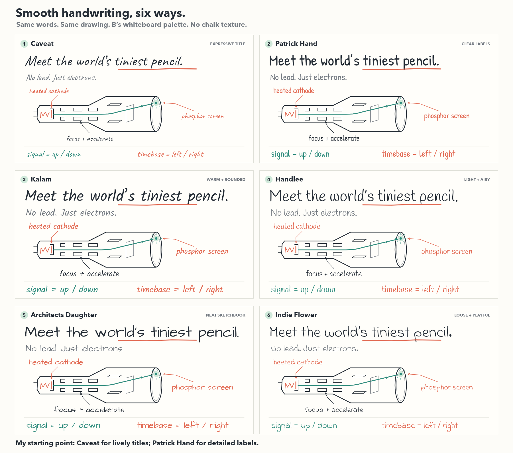

# Smooth handwritten font options

These six samples use actual font files from the official **google/fonts** repository. Each has the same title, subtitle, labels, drawing and whiteboard palette. No chalk texture, image overlay or artificially distressed lettering is applied. The titles fit a shared width without stretching their letterforms.

**Recommended starting point:** Caveat for expressive titles, with Patrick Hand for detailed labels. If using one family throughout, Patrick Hand offers the clearest small labels; Kalam gives a warmer, more slanted pen style. These are design recommendations, not a selected final direction.

| # | Font | Character | Designer in Google Fonts metadata | Official specimen | Official source and licence |
|---|---|---|---|---|---|
| 1 | Caveat | Expressive, flowing pen strokes; sample uses weight 500 | Impallari Type | [Google Fonts](https://fonts.google.com/specimen/Caveat) | [Files](https://github.com/google/fonts/tree/main/ofl/caveat) · [OFL](https://github.com/google/fonts/blob/main/ofl/caveat/OFL.txt) |
| 2 | Patrick Hand | Upright, simple and especially clear for labels | Patrick Wagesreiter | [Google Fonts](https://fonts.google.com/specimen/Patrick+Hand) | [Files](https://github.com/google/fonts/tree/main/ofl/patrickhand) · [OFL](https://github.com/google/fonts/blob/main/ofl/patrickhand/OFL.txt) |
| 3 | Kalam | Rounded, slanted handwriting with a stronger pen stroke | Indian Type Foundry | [Google Fonts](https://fonts.google.com/specimen/Kalam) | [Files](https://github.com/google/fonts/tree/main/ofl/kalam) · [OFL](https://github.com/google/fonts/blob/main/ofl/kalam/OFL.txt) |
| 4 | Handlee | Light, narrow, airy handwriting | Joe Prince | [Google Fonts](https://fonts.google.com/specimen/Handlee) | [Files](https://github.com/google/fonts/tree/main/ofl/handlee) · [OFL](https://github.com/google/fonts/blob/main/ofl/handlee/OFL.txt) |
| 5 | Architects Daughter | Broad, neat sketchbook lettering | Kimberly Geswein | [Google Fonts](https://fonts.google.com/specimen/Architects+Daughter) | [Files](https://github.com/google/fonts/tree/main/ofl/architectsdaughter) · [OFL](https://github.com/google/fonts/blob/main/ofl/architectsdaughter/OFL.txt) |
| 6 | Indie Flower | Loose, rounded and playful | Kimberly Geswein | [Google Fonts](https://fonts.google.com/specimen/Indie+Flower) | [Files](https://github.com/google/fonts/tree/main/ofl/indieflower) · [OFL](https://github.com/google/fonts/blob/main/ofl/indieflower/OFL.txt) |

All six downloaded families include the **SIL Open Font License, Version 1.1** in `font-assets/<family>/OFL.txt`. The original files, metadata, descriptions and licence notices are bundled alongside the renderer. They were retrieved from the official repository on 26 September 2026; the font binaries have not been modified.

Copyright notices retained in the bundled licences:

- Caveat: Copyright 2014 The Caveat Project Authors.
- Patrick Hand: Copyright 2010–2012 Patrick Wagesreiter.
- Kalam: Copyright 2014 Indian Type Foundry.
- Handlee: Copyright 2011 Joe Prince, Vissol Ltd.; Reserved Font Name “Handlee”.
- Architects Daughter: Copyright 2010 Kimberly Geswein.
- Indie Flower: Copyright 2010 The Indie Flower Authors.

The oscilloscope drawings are original code geometry. The font files are the only external creative assets used in the comparison; no reference artwork was copied. Neutral family names and option numbers use locally installed Avenir Next; that system font is not redistributed.

## Deliverables

- [Six-option comparison, 1800 × 1590](handwritten-font-options.png)
- [1 — Caveat, 1676 × 900](font-option-01-caveat.png)
- [2 — Patrick Hand, 1676 × 900](font-option-02-patrickhand.png)
- [3 — Kalam, 1676 × 900](font-option-03-kalam.png)
- [4 — Handlee, 1676 × 900](font-option-04-handlee.png)
- [5 — Architects Daughter, 1676 × 900](font-option-05-architectsdaughter.png)
- [6 — Indie Flower, 1676 × 900](font-option-06-indieflower.png)
- [Editable rendering source](render-font-options.cjs)

Run `node render-font-options.cjs` with `@napi-rs/canvas` installed. The renderer also recognises this workspace’s bundled Canvas runtime. Font assets should remain in the accompanying `font-assets` directory.
